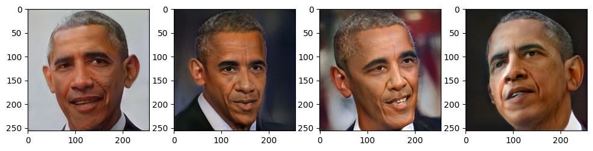
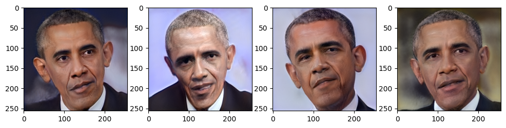

# [KD-DLGAN: Data Limited Image Generation via Knowledge Distillation](https://openaccess.thecvf.com/content/CVPR2023/papers/Cui_KD-DLGAN_Data_Limited_Image_Generation_via_Knowledge_Distillation_CVPR_2023_paper.pdf)

Kaiwen Cui, Yingchen Yu, Fangneng Zhan,  Shengcai Liao,  Shijian Lu, Eric Xing

*CVPR 2023*

## Samples from the style-ganv2 - trained 680 epochs

### DA (Baseline)

### KD-DLGAN

This folder provides a re-implementation of this paper in PyTorch, developed as part of the course METU CENG 796 - Deep Generative Models. The re-implementation is provided by:
* Ibrahim Ersel Yiğit, e244907@metu.edu.tr 
* Meriç Karadayı, e244855@metu.edu.tr

Please see the jupyter notebook file [main.ipynb](main.ipynb) for a summary of paper, the implementation notes and our experimental results.

**Optional**: installation instructions, and any other comments you may want to add. 