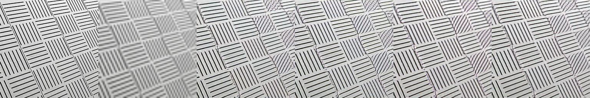

# [SeD: Semantic-Aware Discriminator for Image Super-Resolution](https://arxiv.org/pdf/2402.19387)

Bingchen Li, Xin Li, Hanxin Zhu, Yeying Jin, Ruoyu Feng, Zhizheng Zhang, Zhibo Chen
**CVPR 2024**
This folder provides a re-implementation of this paper in PyTorch, developed as part of the course METU CENG 796 - Deep Generative Models. The re-implementation is provided by:
* Mustafa Utku Aydoğdu, e270206@metu.edu.tr 
* Yiğit Ekin, e270207@metu.edu.tr

Please see the jupyter notebook file [main.ipynb](main.ipynb) for a summary of paper, the implementation notes and our experimental results.

### Installation:

In order to replicate the results one first needs to create the conda environment by executing the following commands:

```bash 
conda env create -f environment.yml
conda activate sed
```
### Results
**Ground Truth (GT) - GT downscaled by 4 - Patchgan - Patchgan + SeD - Pixelwise - Pixelwise + SeD**
<div style="display:flex; justify-content:center; align-items:center; flex-direction:column;">




</div>