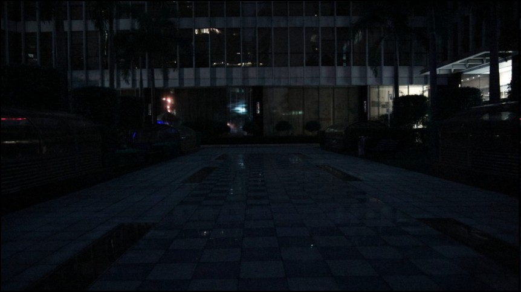
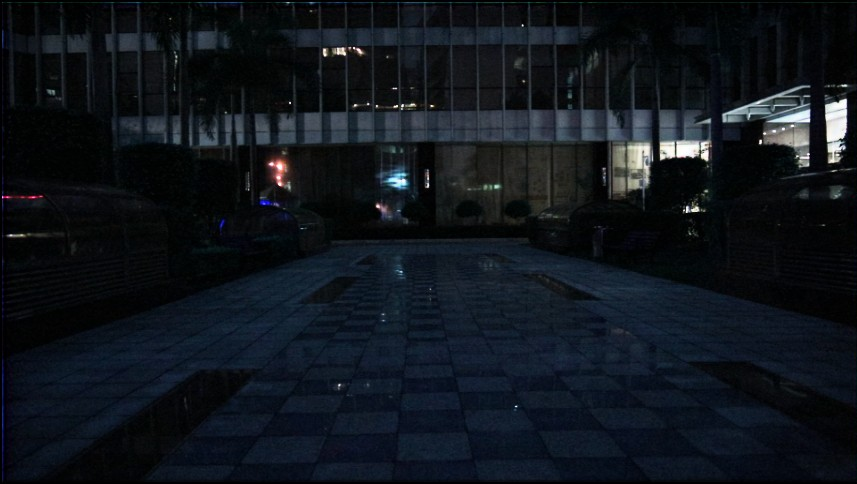
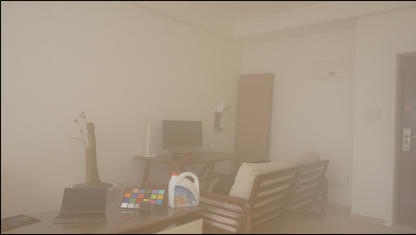
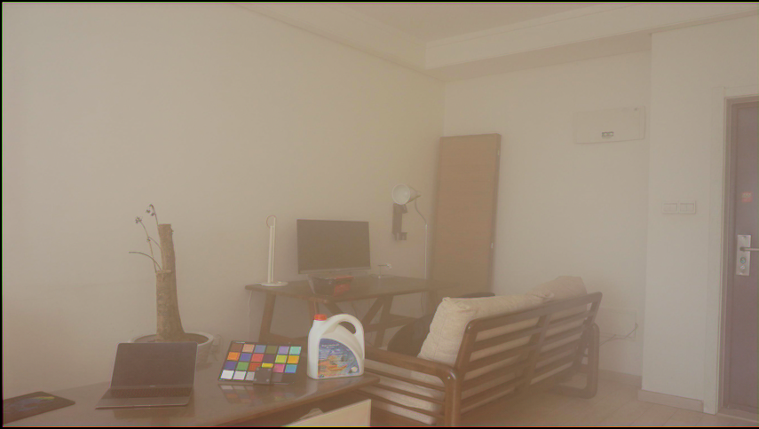
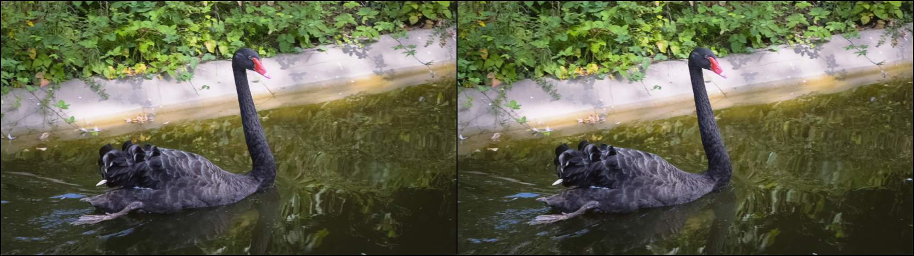
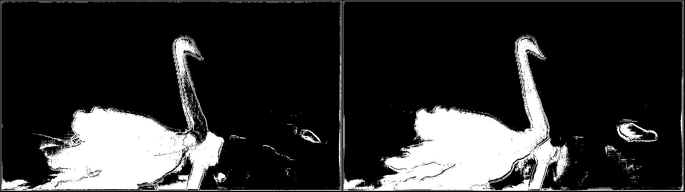

Sem# [Video Decomposition Prior: Editing Videos Layer by Layer](https://openreview.net/pdf?id=nfMyERXNru)

Gaurav Shrivastava, Ser-Nam Lim, Abhinav Shrivastava

*ICLR 2024*

## Relighting Results

Below are the results before and after applying the relighting task:

| Before Relighting | After Relighting |
|-------------------|------------------|
|  |  |

## Dehazing Results

Below are the results before and after applying the dehazing task:

| Before Dehazing | After Dehazing |
|-----------------|----------------|
|  |  |


## Segmentation Results

Below are the results before and after applying the segmentation task:

| Input Image | Segmentation Map |
|-----------------|----------------|
|  |  |


This folder provides a re-implementation of this paper in PyTorch, developed as part of the course METU CENG 796 - Deep Generative Models. The re-implementation is provided by:
* Furkan Küçük, kucuk.furkan@metu.edu.tr
* Alper Bahçekapılı, alper.bahcekapili@metu.edu.tr

Please see the jupyter notebook file [main.ipynb](main.ipynb) for a summary of paper, the implementation notes and our experimental results.

## Abstract

In the evolving landscape of video editing methodologies, a majority of deep learning techniques are often reliant on extensive datasets of observed input and ground truth sequence pairs for optimal performance. Such reliance often falters when acquiring data becomes challenging, especially in tasks like video dehazing and relighting, where replicating identical motions and camera angles in both corrupted and ground truth sequences is complicated. Moreover, these conventional methodologies perform best when the test distribution closely mirrors the training distribution. Recognizing these challenges, this paper introduces a novel video decomposition prior ‘VDP’ framework which derives inspiration from professional video editing practices. Our methodology does not mandate task-specific external data corpus collection, instead pivots to utilizing the motion and appearance of the input video. VDP framework decomposes a video sequence into a set of multiple RGB layers and associated opacity levels. These set of layers are then manipulated individually to obtain the desired results. We addresses tasks such as video object segmentation, dehazing, and relighting. Moreover, we introduce a novel logarithmic video decomposition formulation for video relighting tasks, setting a new benchmark over the existing methodologies. We evaluate our approach on standard video datasets like DAVIS, REVIDE, & SDSD and show qualitative results on a diverse array of internet videos.


## Contents

The repository is organized as follows:

- `env.yml`: Environment configuration file for Conda.
- `main_relight.py`: Main script for the relighting task.
- `benchmark_relight.py`: Benchmarking script for relighting task.
- `main_dehaze.py`: Main script for the dehazing task.
- `benchmark_dehaze.py`: Benchmarking script for dehazing task.
- `main_segmentation.py`: Main script for the segmentation task.
- `benchmark_segmentation.py`: Benchmarking script for segmentation task.
- `setup.py`: Setup script for the project.
- `video_dip/`: Directory containing the core modules, data handling, and metrics.

## Installation

To set up the environment for this project, follow these steps:

1. Clone the repository:
    ```bash
    git clone https://github.com/iamkucuk/VideoDIP.git
    cd video_dip
    ```

2. Create the Conda environment:
    ```bash
    conda env create -f env.yml
    conda activate video_dip
    ```

3. Download the data and models:
    ```bash
    bash download_data.sh
    ```

### Optional step

4. Install the project:
    ```bash
    pip install -e .
    ```

## Usage

### Viewing the previous results

Download script will download the pretrained models and the results of the previous runs, as tensorboard logs within `tb_logs` folder. You can view the results by running the following command:

```bash
tensorboard --logdir tb_logs
```

### Dehazing

For the dehazing task, the airlight maps should be extracted first. To do this, refer to the GitHub repository: [Dehazing-Airlight-estimation](https://github.com/iamkucuk/Dehazing-Airlight-estimation). Follow the instructions in the repository to extract the airlight maps for your dataset. 

Example workflow to extract airlight maps:

1. Clone the airlight estimation repository:
    ```bash
    git clone https://github.com/iamkucuk/Dehazing-Airlight-estimation.git
    cd Dehazing-Airlight-estimation
    ```

2. Install the required dependencies and run the airlight estimation script on your dataset. This will save the airlight maps to a specified directory.

3. Once the airlight maps are extracted, you can proceed with the dehazing task using the `main_dehaze.py` script.

To dehaze videos using the `DehazeVDPModule`, you can use the `main_dehaze.py` script.

Example:
```bash
python main_dehaze.py --input_path "datasets/dehazing/hazy/C005" --target_path "datasets/dehazing/gt/C005" --airlight_est_path "datasets/dehazing/processed/C005"
```

To benchmark dehazing across multiple sub-folders in a dataset, use the benchmark_dehaze.py script.

Example:
```bash
python benchmark_dehaze.py --dataset_path "datasets/dehazing"
```

### Relighting

To relight videos using the RelightVDPModule, you can use the main_relight.py script.

Example:
```bash
python main_relight.py --input_path "datasets/relighting/outdoor_png/input/pair76" --target_path "datasets/relighting/outdoor_png/GT/pair76"
```

To benchmark relighting across multiple sub-folders in a dataset, use the benchmark_relight.py script.

Example:
```bash
python benchmark_relight.py --dataset_path "datasets/relighting/outdoor_png"
```

### Segmentation

To segment videos using the SegmentationVDPModule, you can use the main_segmentation.py script.

Example:
```bash
python main_segmentation.py --input_path "datasets/input/bear" --target_path "datasets/GT/pair1"
```

To benchmark segmentation across multiple sub-folders in a dataset, use the benchmark_segmentation.py script.

Example:
```bash
python benchmark_segmentation.py --dataset_path "datasets"
```

Dataset Structure
The dataset should be organized in a hierarchical structure, with separate folders for each task and each sub-folder containing the input and target data. Below is an example structure for each task:

#### Dehazing
```text
datasets/
└── dehazing/
    ├── hazy/
    │   ├── C005/
    │   │   ├── 0001.png
    │   │   ├── 0002.png
    │   │   └── ...
    │   └── ...
    ├── gt/
    │   ├── C005/
    │   │   ├── 0001.png
    │   │   ├── 0002.png
    │   │   └── ...
    │   └── ...
    └── processed/
        ├── C005/
        │   ├── 0001_estimatedAirlight.csv
        │   ├── 0002_estimatedAirlight.csv
        │   └── ...
        └── ...
```

#### Relighting
```text
datasets/
└── relighting/
    ├── outdoor_png/
    │   ├── input/
    │   │   ├── pair76/
    │   │   │   ├── 0001.png
    │   │   │   ├── 0002.png
    │   │   │   └── ...
    │   │   └── ...
    │   └── GT/
    │       ├── pair76/
    │       │   ├── 0001.png
    │       │   ├── 0002.png
    │       │   └── ...
    │       └── ...
```


#### Segmentation
```text
datasets/
└── segmentation/
    ├── davis/
    │   ├── input/
    │   │   ├── bear/
    │   │   │   ├── 0001.jpg
    │   │   │   ├── 0002.jpg
    │   │   │   └── ...
    │   │   └── ...
    │   └── GT/
    │       ├── bear/
    │       │   ├── 0001.jpg
    │       │   ├── 0002.jpg
    │       │   └── ...
    │       └── ...
```


## Workflow

The workflow of the project involves the following steps:

1. **Data Preparation**: Organize your datasets in a structure where each sub-folder contains the input and target (ground truth) images or videos. For the dehazing task, ensure you have extracted the airlight maps using the [Dehazing-Airlight-estimation](https://github.com/iamkucuk/Dehazing-Airlight-estimation) repository.

2. **Training**: Use the main scripts (`main_relight.py`, `main_dehaze.py`, `main_segmentation.py`) to train the models on your datasets. Adjust the hyperparameters as needed using command-line arguments.

3. **Benchmarking**: Use the benchmarking scripts (`benchmark_relight.py`, `benchmark_dehaze.py`, `benchmark_segmentation.py`) to evaluate the performance of the models across multiple sub-folders in the datasets.

4. **Evaluation**: The metrics (PSNR, SSIM, IoU) are logged during training and evaluation. The results are logged using the user's preferred logger, either TensorBoard or Weights & Biases.

## Outputs

The outputs of the project include:

- **Metrics**: Performance metrics such as PSNR, SSIM and IoU are logged and saved.
- **Processed Videos/Images**: The processed videos or images are logged using the user's preferred logger (TensorBoard or Weights & Biases).
- **Model Checkpoints**: Model checkpoints are saved during training, allowing you to resume training or use the trained models for inference.

## Important Code Components

### video_dip/data

#### dataset.py

- **VideoDIPDataset**: A custom dataset class for loading video frames or images for VideoDIP. It handles the input frames, target frames, optical flow frames, and airlight estimations. The class includes methods to load and process images and videos, apply default transformations, and manage airlight estimations.

#### datamodule.py

- **VideoDIPDataModule**: A PyTorch Lightning data module that manages the dataset for training, validation, and testing. It includes methods to dump optical flow, set up the dataset, and create data loaders for different stages of the training process.

### video_dip/models

#### unet.py

- **UNet**: A convolutional neural network architecture for image segmentation. It consists of an encoder and a decoder, with skip connections between them. The UNet model is used in various modules for tasks such as generating RGB and alpha layers.

#### optical_flow

- **raft.py**: Contains the implementation of the RAFT model for optical flow estimation. It includes methods to load the model, prepare input images, and perform forward passes to generate flow predictions.

- **farneback.py**: Implements the Farneback method for optical flow estimation using OpenCV. It includes methods to compute optical flow between frames and postprocess the results.

### video_dip/models/modules

#### base.py

- **VDPModule**: A base class for VideoDIP modules. It includes the initialization of UNet models for RGB and alpha outputs, loss functions (reconstruction and warp loss), and methods for forward pass, inference, training step, validation step, and optimizer configuration.

#### dehaze.py

- **DehazeVDPModule**: A module for dehazing in VideoDIP. It extends `VDPModule` and includes additional methods for reconstructing outputs using airlight estimations and calculating performance metrics (PSNR and SSIM).

#### relight.py

- **RelightVDPModule**: A module for relighting in VideoDIP. It extends `VDPModule` and includes a learnable parameter `gamma_inv` for adjusting the relighting effect. The module also includes methods for reconstruction and calculating performance metrics.

#### segmentation.py

- **SegmentationVDPModule**: A module for segmentation in VideoDIP. It extends `VDPModule` and includes additional loss functions (flow similarity loss, reconstruction layer loss, and mask loss) and methods for reconstructing segmented outputs.

### video_dip/losses

#### Various loss functions for training

- **ReconstructionLoss**: Combines L1 loss and perceptual loss to compute the reconstruction loss.
- **OpticalFlowWarpLoss**: Ensures temporal coherence by warping images according to the optical flow.
- **FlowSimilarityLoss**: Measures the similarity between motion tensor and RGB flow.
- **ReconstructionLayerLoss**: Computes reconstruction loss based on intermediate layers.
- **MaskLoss**: Ensures binarized mask predictions.

### video_dip/metrics

#### pnsr.py and ssim.py

- **PNSR**: Computes the Peak Signal-to-Noise Ratio (PSNR) between original and reconstructed frames.
- **SSIM**: Computes the Structural Similarity Index Measure (SSIM) between original and reconstructed frames.
- **IoU**: Computes the Intersection over Union Measure (IoU) between original and predicted segmentation.

### video_dip/callbacks

#### image_logger.py

- **ImageLogger**: A PyTorch Lightning callback for logging images during validation. It supports logging to TensorBoard and Weights & Biases, capturing inputs, labels, predictions, and optical flow.

## Acknowledgments

This project is developed by Furkan & Alper. It uses PyTorch Lightning for model training and evaluation. Here're the list of the models and papers that are used:

- “Video Decomposition Prior: Editing Videos Layer by Layer”, The Twelfth International Conference on Learning Representations, Jun. 20, 2024. https://openreview.net/forum?id=nfMyERXNru

- Bahat, Y., & Irani, M. (2016). Blind dehazing using internal patch recurrence. In 2016 IEEE International Conference on Computational Photography, ICCP 2016 - Proceedings Article 7492870 https://doi.org/10.1109/ICCPHOT.2016.7492870

- https://github.com/dvlab-research/SDSD

- https://github.com/BookerDeWitt/REVIDE_Dataset

## License

This project is licensed under the MIT License. See the LICENSE file for more details.

---
