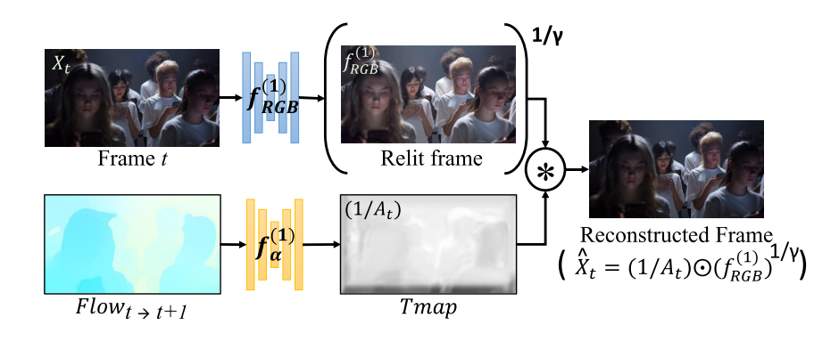
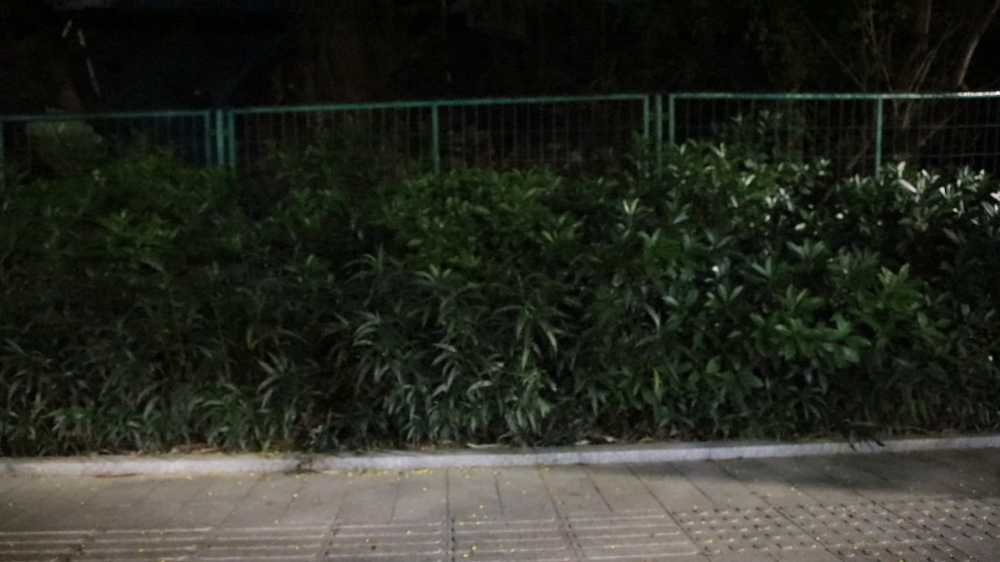
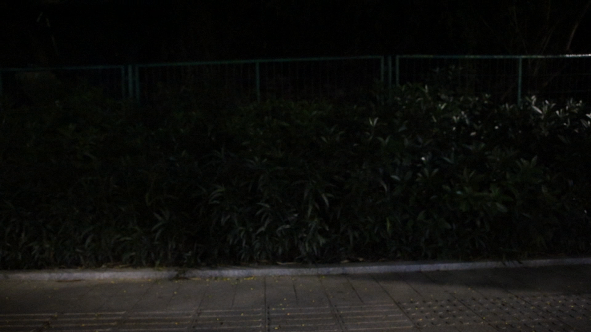
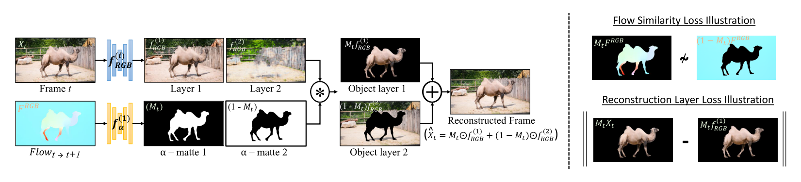
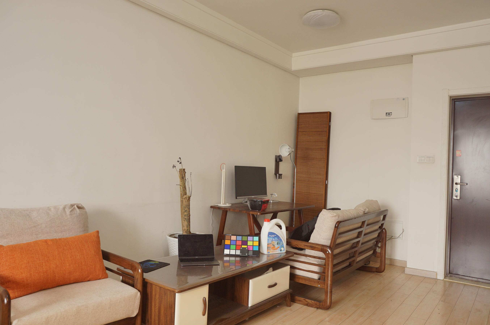
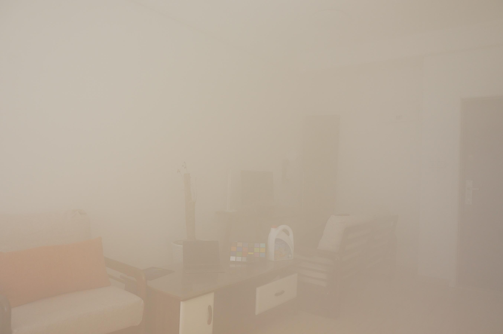

# VIDEO DECOMPOSITION PRIOR: EDITING VIDEOS LAYER BY LAYER

Paper Authors: 

| Name | Shcool | Mail |
| ---- | ------ | ---- |
| Gaurav Shrivastava | University of Maryland, College Park | gauravsh@umd.edu|
| Abhinav Shrivastava | University of Maryland, College Park | abhinav@cs.umd.edu
| Ser-Nam Lim | University of Central Florida | sernam@ucf.edu |

Project Authors: Alper Bahçekapılı, Furkan Küçük

Paper Summary: Paper is a deep learning framework to edit videos without supervision. Namely following three downstream tasks are adressed in the paper:

* Video Relighting
* Video Dehazing
* Unsupervised Video Object Segmentation

## Overall Logic of the Paper:

Paper approaches the problem with the intuition from video editing programs. As in these programs, they treat the videos as they are composed of multiple layers. For relighting problem, one layer is relight-map and the other is dark frame. In dehazing, again similar to reliht one layer is t-map etc. For segmentation, layers are foreground objects layer and the other is background layer. 

All optimization is done in the inference time. So for each of the video, we train models from the ground up. Paper realize given solutions with two main modules. RGB-net and $\alpha$-net models. For each of the problem type, these models quantity(1 RGB-net for relight, 2 RGB-net for segmentation) and purpose change. 

These models harness the information that is obtained by flow between the frames. Inclusion of optical flow captures motion effectively and makes the model significantly moer resilient to variations in lighting. Paper uses RAFT [1] for flow estimation

## Modules Overview

**RGBnet:** Given that we only optimize the weights over a single video, a shallow convolutional U-Net is sufficent for the task. This model takes $X_t$ of the video seq. and outputs RGB layer. 

**$\alpha$ Layer:** Similar to RGBNet arcitecture is again shallow U-Net for predicting the t-maps or opacity layer. This layer takes RGB representation of the forward optical flow($F^{RGB}_{t\rightarrow t-1}$) 

## Video Relighting

By manipulating the shading and lighting layers, the method allows for changing the illumination conditions of a video. This can be used to simulate different times of day, weather conditions, or artificial lighting effects.
The relighting process involves adjusting the lighting layer to achieve the desired illumination effect while maintaining the natural appearance and coherence of the video.

The goal of the video relighting task is to recover video ${\{(X_t^{out})\}^T_1}$ with good lighting conditions from its poorly lit pair $\{X_t^{in}\}^T_1$. Authors model transmittion map ($1 / A_t$) with the $\alpha$-net model. They model $\gamma^{-1}$ as a learnable parameter where it can take values from the range (0,1). Pipeline is given by the Figure 1.

    <figure>
        
        <figcaption>Figure 1: Video Relighting</figcaption>
    </figure>

$F^1_{RGB}$, $F^1_{\alpha}$, $\gamma^{-1}$ are optimized with the following loss objectives(below are general definition of the losses. Each module updates these a little)

**Overall Loss Objective:** $L_{final}$ = $\lambda_{rec}$ $L_{rec}$ + $\lambda_{warp}$ $L_{warp}$ (1)

**Reconstruction Loss:** $\sum_t ||X_t - \hat{X_t}||_1 + || \phi (X_t) - \phi (\hat{X_t})||_1$ (2)

**Optical Flow Warp Loss** $\sum_t || F_{t-1 \rightarrow t} (X_{t-1}^o) -  X_{t}^o  ||$ (3)

Relit video is reconstructed with the following equation.

$X_t^{out} = A_t \odot  (X_t^{in})^{\gamma}$,  $\forall t \in (1,T]$ (4)

For the VDP framework authors update eq. 4 as follows

$log(X_t^{in}) = \gamma^{-1}(log(1/A_t)+log(x_t^{out}))$, $\forall t \in (1,T]$ (5)

Relighting task is evaluated on SDSD dataset where the video has relit and dark version of these. SSIM and PSNR metrics are utilized in order to evaluate quantatively. You can see an example from the SDSD dataset in the Figure 2

    <figure>
        
        
        <figcaption>Figure 2: SDSD Dataset Example: Relit version of the image is on the left. Right part is the darker counterpart</figcaption>
    </figure>

Eventough paper did not explain following metrics in detail, we believe it is important to exmplain them a little. They are used in dehazing task as well: 

**PSNR Metric:** The PSNR (Peak Signal-to-Noise Ratio) metric is a widely used quantitative measure for evaluating the quality of reconstructed or processed images and videos compared to their original versions. PSNR is expressed in decibels (dB). Higher PSNR values indicate better quality of the reconstructed or processed image/video compared to the original. 

**SSIM Metric:** The SSIM (Structural Similarity Index Measure) is a metric used to measure the similarity between two images. Unlike PSNR, which focuses on pixel-level differences, SSIM considers changes in structural information, luminance, and contrast, providing a more comprehensive assessment of perceived image quality. The SSIM index can range from -1 to 1, where 1 indicates perfect similarity.

## Unsupervised Video Object Segmentation

Given the input video, target of the unsupervised video object segmentation is to segment out the main object in the video. Note that in any stage any human annotations are not needed. They start by $\alpha$-blending equation to write the reconstruction of the input video.
 
$X_t = \sum_{i=1}^{L} M_t^i \odot f_{\text{RGB}}^i(X_t) \quad \forall t \in (1, T]$ (6)

Here L is the number of layers(number of masks generated by $\alpha$-net) Here $M_t^i$ denotes the alpha map for the ith object layer and tth frame. And it is obrained as follows:

$M_t^i = f_{\alpha}^i(F_{t-1 \to t}^{\text{RGB}}) \quad \forall t \in (1, n]$ (7)

where $F_{t-1 \to t}^{\text{RGB}}$ is the flow estimate from t-1 to t. Additionally followin constraint should also satisfy:

$J_{h,w} = \sum_{i=1}^{L} M_t^i$ (8)

where $J_{h,w}$ denotes all-ones matrix of size [h,w]

However video decomposition problem is ill-posed and loss equation (1) is not strong enough to find a visually plausible layered decomposition of an input video. We need opacity layers to be binary masks. Therefore, a few additional regularization losses are implemented:

**Flow Similarity Loss:** This loss ensures motion of different layers are uncorrelated. They define the loss as cosine similarity between the VGG embeddings of the masked flow-RGB of layer i with the rest of the layers (for L=2 one layer is reverse of the other)  Here $\phi$ denotes the VGG network. $F^{RGB}$ is RGB image of flow estimate from frame t-1 to t.

$L_{\text{sim}} = \frac{\phi(M \circ F^{\text{RGB}}) \cdot \phi((1 - M) \circ F^{\text{RGB}})}{\|\phi(M \circ F^{\text{RGB}})\| \| \phi((1 - M) \circ F^{\text{RGB}})\|}$ (9)

**Mask Loss:** This loss enforces the binarization of the generated layer mask. [2]

$\mathcal{L}_{\text{Mask}} = \sum \left( M_t^i - 0.5 \right)^{-1}$ (10)

**Reconstruction Layer Loss:** This loss ensures layer i is a segment of the input. Following L1 loss is defined between the masked RBG prediction of layer i and maksed RGB image prediction of original video. 

$L_{\text{layer}} = \| M_i \circ X_t - M_i \circ X_{t+1} \|$ (11)

In conclusion, following is the resulting loss in unsupervised vide object segmentation. 

$L_{\text{UVOS}} = \lambda_{\text{rec}}L_{\text{rec}} + \lambda_{\text{sim}}L_{\text{sim}} + \lambda_{\text{layer}}L_{\text{layer}} + \lambda_{\text{warp}}L_{\text{warp}} + \lambda_{\text{mask}}L_{\text{mask}}$ (12)

Where weight for are as following: λrec = 1, λFsim = 0.001, λlayer = 1, λwarp = 0.01 and λMask = 0.01.

Two RGBnets and one $\alpha$-net is initialized. Overall procedure is illustrated in Figure 3.

    <figure>
        
        <figcaption>Figure 3: Overall Framework for  </figcaption>
    </figure>

Because we are dealing with two RGB networks reconstruction function is updated as follows: 

$X_i = M_{t} \odot  f_{\text{RGB}}^1(X_t) + (1 - M_{t}) \odot  f_{\text{RGB}}^2(X_t) \forall i \in [1,n]$ (13)

## Video Dehazing

Videos captured in outdoor environments often suffer from degradation caused by scattering mediums like haze, fog, or underwater particles. This degradation intensifies as the depth of the scene increases. We can write a hazy video $\{X_t\}^T_1$ as explained in [3]

$X_t = \alpha \odot Clr(X_t) + (1-\alpha) \odot A_t$ (14)

where $A_t$ is the Airlight map (A-map), $Clr(X^t)$ is the haze-free image, and $\alpha$ here is the transmission map (t-map). The goal is to recover clear underlying content $\{Clr(X't)\}^T_1$ from a hazy input $\{X_t\}^T_1$. Again they treat the dehazing problem as a video decomposition problem where one layer is the haze-free video and the other is Airlight map. Airlight map is obtained by [4] and kept as fixed.[our fork](https://github.com/iamkucuk/Dehazing-Airlight-estimation) Then t-maps are generated by $\alpha$-net model. 

To evaluate dehazing REVIDE dataset is used. As in relightinh SSIM and PSNR metrics are utilized. You can see an example of this dataset in Figure 4:

    <figure>
        
        
        <figcaption> Figure 4: REVIDE dataset example  </figcaption>
    </figure>

## Conclusion

In summary VIDEODIP demonstrated layered decomposition can be utilized to multiple downstream tasks without the need of supervision. Additionally, paper achieve state-of-the-art performances in UVOS(Unsupervised Video Object Segmentation), dehazing and relighting. 

## References

[1] Zachary Teed and Jia Deng. Raft: Recurrent all-pairs field transforms for optical flow. In European
conference on computer vision, pp. 402–419. Springer, 2020.

[2] Yosef Gandelsman, Assaf Shocher, and Michal Irani. ” double-dip”: Unsupervised image decompo-
sition via coupled deep-image-priors. In Proceedings ofthe IEEE/CVF Conference on Computer
Vision and Pattern Recognition, pp. 11026–11035, 2019.

[3] Kaiming He, Jian Sun, and Xiaoou Tang. Single image haze removal using dark channel prior. IEEE
transactions on pattern analysis and machine intelligence, 33(12):2341–2353, 2010.

[4] Yuval Bahat and Michal Irani. Blind dehazing using internal patch recurrence. In 2016 IEEE
International Conference on Computational Photography (ICCP), pp. 1–9. IEEE, 2016.